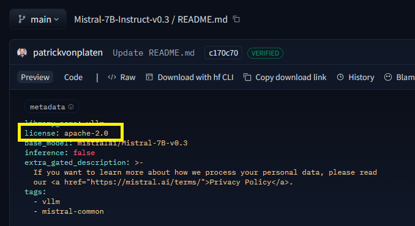
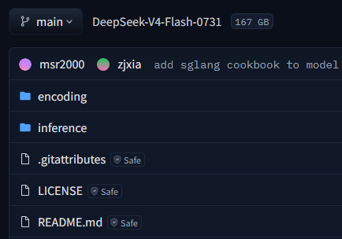
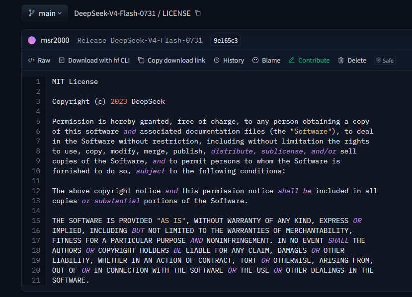

# Bài 1: Vì sao cần fine-tuning và tự host LLM? So sánh với dùng API đóng
## 1.1. API đóng và tự host
- API đóng:
    + Không thấy trọng số (weight) và không thay đổi được nó
    + Không thay đổi được dữ liệu đầu ra
    + Cần có mạng
    + Chi phí ban đầu gần như bằng 0 nhưng tăng dần đều theo số token
- Tự host:
    + Cần tải trọng số mô hình mã nguồn mở về
    + Chạy trên GPU của mình hoặc trên cloud
    + Mô hình và dữ liệu nằm trong tầm kiểm soát
    + Rẻ dần khi lưu lượng cao (phần lớn chi phí là chi phí cố định (mua/thuê GPU, xây hạ tầng, lương kỹ sư vận hành, license phần mềm...). Những chi phí này gần như không đổi dù bạn xử lý 1.000 hay 10 triệu request/tháng. Chi phí biến đổi thật sự (điện, băng thông) chỉ là phần rất nhỏ.)
    + Có thể tùy biến mô hình (fine-tune trọng số)

## 1.2. Fine-tuning là gì, và khi nào thật sự cần?
+ `Fine-tune` là việc lấy 1 pre-trained model rồi huấn luyện thêm trên dữ liệu riêng của mình để mô hình quen với phong cách, thuật ngữ, định dạng đầu ra mong muốn
+ `Fine-tune` không phải nhồi kiến thức mới vào mô hình tin cậy, đó là phần việc của `RAG`. `Fine-tune` là dạy hành vi, phong cách, định dạng.

|Nhu cầu|Công cụ|
|-------|-------|
|Đổi phong cách, giọng văn, định dạng đầu ra| Fine-tuning|
|Dạy mô hình một tác vụ hẹp lặp lại (phân loại, trích xuất)|Fine-tuning|
|Trả lời dựa trên tài liệu/dữ kiện luôn thay đổi|RAG|
|Thử nhanh một ý tưởng, prototype|	Prompt engineering trên API|
|Giảm chi phí cho tác vụ lượng lớn, ổn định|	Fine-tune mô hình nhỏ + tự host|

⚠️ __Sai lầm kinh điển:__ “Model trả lời chưa đúng, chắc phải fine-tune”. Rất nhiều lần, sửa prompt cho rõ hoặc thêm RAG là đủ - và rẻ hơn, nhanh hơn fine-tuning rất nhiều. Hãy leo thang theo thứ tự: `prompt -> few-shot -> RAG -> fine-tuning`, chỉ __fine-tune khi 3 bước trước không đủ__.

## 1.3. Khi nào nên dùng API, khi nào nên tự host
+ `Dưới điểm hòa vốn` (tự search cách tính) thì ưu tiên API đóng
+ Nếu `trên điểm hòa vốn` hay `cần bảo mật dữ liệu` thì tự host sẽ được ưu tiên hơn

Điểm hòa vốn (break-even point) chính là chỗ hai đường cắt nhau trên biểu đồ: dưới mức lưu lượng đó, tự host lỗ vì chưa "khai thác hết" hạ tầng đã đầu tư; vượt qua mức đó, mỗi token xử lý thêm gần như miễn phí (chỉ tốn điện), trong khi API vẫn tính tiền đều đặn theo từng token.

## 1.4. Một dự án tự host LLM gồm gì?

+ Lượng tử hóa NF4 (trước fine-tune) — đây chính là kỹ thuật đằng sau chữ "Q" trong QLoRA. Người ta `nén mô hình gốc xuống 4-bit trước`, rồi đóng băng nó và `chỉ huấn luyện các adapter LoRA nhỏ` (ở độ chính xác cao hơn) chồng lên trên. Mục đích: giảm VRAM cần thiết để fine-tune, cho phép train mô hình lớn trên GPU nhỏ.
+ Lượng tử hóa GGUF/GPTQ/AWQ (sau fine-tune) — sau khi train xong và gộp adapter vào mô hình gốc, người ta `nén các trọng số sau khi gộp` lại một lần nữa để mô hình chạy suy luận (inference) nhẹ và nhanh hơn khi triển khai thực tế. Mục đích: giảm chi phí và độ trễ khi phục vụ, không liên quan đến việc huấn luyện nữa.

__Ước lượng VRAM (bộ nhớ GPU) cần khi chỉ suy luận:__ $\text{số bytes mỗi tham số} \times \text{số tham số}$. Ví dụ: ở `fp32` hay ở độ chính xác `32 bit` thì mỗi tham số cần $32/8=4 \text{bytes}$ và mô hình có 7B tham số $\rightarrow 7.000.000.000 \times 4 = 28.000.000.000 \text{bytes} = 28\text{GB}$

__Bảng định dạng và số byte/tham số__

|Định dạng|Số bit|Byte/tham số|
|---------|------|------------|
|FP32|32|$32/8=4$|
|FP16|16|2|
|INT8|8|1|
|INT4|4|0.5|

Đây là lý do `lượng tử hóa (quantization)` và `QLoRA (fine-tune trên mô hình đã nén 4-bit)` quan trọng đến vậy: chúng biến “phải có GPU trung tâm dữ liệu đắt tiền” thành “chạy được trên một GPU tiêu dùng”. Còn `huấn luyện đầy đủ (full fine-tune) tốn gấp nhiều lần vì phải lưu thêm gradient và trạng thái optimizer` - đó là lý do LoRA/QLoRA gần như luôn là mặc định cho người tự host. Con số chính xác sẽ đào sâu ở các bài về lượng tử hóa và QLoRA.

## 1.5. Note

+ Trước khi fine-tune, luôn hỏi: prompt/few-shot/RAG đã đủ chưa? Fine-tune là bậc thang cuối, không phải đầu tiên.
+ Quyết định “API hay tự host” bằng 4 động lực: riêng tư, chi phí, kiểm soát, độ trễ - không quyết theo cảm tính.
+ Xem xét kiến trúc lai (hybrid): API cho việc khó/hiếm, mô hình tự host đã fine-tune cho việc lặp lại + nhạy cảm.

# Bài 2: Kiến trúc Transformer và cách LLM sinh văn bản
## 2.1. Self-attention
Khi cần đoán từ tiếp theo cho "Con mèo ngồi trên tấm ..." thì self-attention cho phép model chú ý tới "mèo", "ngồi". Tổng quát hơn, self-attention tính toán xem token nào khác trong câu đáng chú ý hơn để hiểu token hiện tại

$\text{Attention}(Q,K,V)=\text{softmax}(\frac{QK^T}{\sqrt{d_k}})V$

Trong đó, $d_k$ là số chiều của vector $K$

Cost: $O(n^2)$ với n là độ dài chuỗi ngữ cảnh.

## 2.2. Encoder, decoder và vì sao LLM là "decoder-only"
?
## 2.3. Autoregressive
LLM sinh văn bản theo vòng lặp autoregressive (tự hồi quy). Tức là sau khi sinh 1 token, nó nối token vào chuỗi $m$ sinh ra chuỗi mới $m'$. Sau đó nó dùng chuỗi $m'$ này để sinh ra token tiếp theo và lặp lại vòng lặp cho đến khi gặp token kết thúc hoặc đủ độ dài.
## 2.4. KV Cache
+ Trong vòng lặp tự hồi quy, mỗi bước tính toán lại Q, K, V cho các token đã có sẽ rất phí --> ta sẽ cache lại K và V của các token cũ

+ Cái giá phải trả: KV cache ăn VRAM và tăng tuyến tính theo độ dài ngữ cảnh. Đây chính là lý do vLLM (bài sau) phát minh PagedAttention để quản lý KV cache như trang bộ nhớ, chống phân mảnh và phục vụ nhiều request đồng thời.

+ Khi tự host, hai thứ ngốn VRAM lớn nhất là trọng số model (cố định) và KV cache (tăng theo ngữ cảnh + số request song song).

## 2.5. Note
+ LLM chỉ đơn giản là tối ưu xác suất mà token tiếp theo có thể xuất hiện dựa trên các token đã được train trước đó.
+ Temperature: Làm phẳng/nhọn phân bố xác suất

# Bài 3: Các họ mô hình mở (Llama, Mistral, Qwen, Gemma) và giấy phép sử dụng
## 3.1. "Open-weight" khác "open-source thực thụ" thế nào?
+ Open-source thực thụ (OSI-approved): dùng license như Apache 2.0 hoặc MIT. Bạn được dùng thương mại thoải mái, sửa đổi, phân phối lại, gần như không ràng buộc (chỉ cần giữ thông báo bản quyền). Mistral, Qwen (dòng open) và Gemma (một phần) đi theo hướng thoáng này.
+ Open-weight có điều kiện (custom license): nhà phát triển tự viết giấy phép riêng, kèm điều khoản hạn chế. Ví dụ kinh điển là Llama Community License của Meta.

__⚠️ Cảnh báo:__ “tải được trọng số” KHÔNG đồng nghĩa “được thương mại hóa tự do”. Luôn đọc file LICENSE trong repo mô hình trước khi đưa vào sản phẩm bán tiền.

## 3.2. Các giấy phép
<i><u><b>TRƯỚC KHI SỬ DỤNG 1 MODEL MỞ NÀO CHO PRODUCT CẦN ĐỌC KĨ LICENSE</b></u></i>
### 3.2.1. Cách xem giấy phép
1. Vào trang web của huggingface
2. Vào mục `Files and versions`
3. Vào file `README.md` để xem license

### 3.2.2. Các giấy phép
#### Apache 2.0

<a src="https://www.apache.org/licenses/LICENSE-2.0">Apache 2.0</a>

+ Mã nguồn không cần công khai khi phần mềm được phân phối.
+ Có thể sử dụng phần mềm được cấp license này hoặc các sản phẩm phái sinh từ phần mềm này cho mục đích thương mại
+ Tự do sử dụng, phân phối và sửa đổi
+ Giấy phép Apache không yêu cầu các bản sửa đổi phải phân phối lại dưới cùng một giấy phép. Tuy nhiên, bạn phải giữ lại thông báo về giấy phép Apache và quyền sở hữu trí tuệ.

Khi thêm các license vào work thì chỉ cần copy nguyên nội dung trên mạng mà nhà cung cấp license công bố vào 1 file `LICENSE` là được.

#### MIT

Copyright \<YEAR> \<COPYRIGHT HOLDER>

Permission is hereby granted, free of charge, to any person obtaining a copy of this software and associated documentation files (the “Software”), to deal in the Software without restriction, including without limitation the rights to use, copy, modify, merge, publish, distribute, sublicense, and/or sell copies of the Software, and to permit persons to whom the Software is furnished to do so, subject to the following conditions:

The above copyright notice and this permission notice shall be included in all copies or substantial portions of the Software.

THE SOFTWARE IS PROVIDED “AS IS”, WITHOUT WARRANTY OF ANY KIND, EXPRESS OR IMPLIED, INCLUDING BUT NOT LIMITED TO THE WARRANTIES OF MERCHANTABILITY, FITNESS FOR A PARTICULAR PURPOSE AND NONINFRINGEMENT. IN NO EVENT SHALL THE AUTHORS OR COPYRIGHT HOLDERS BE LIABLE FOR ANY CLAIM, DAMAGES OR OTHER LIABILITY, WHETHER IN AN ACTION OF CONTRACT, TORT OR OTHERWISE, ARISING FROM, OUT OF OR IN CONNECTION WITH THE SOFTWARE OR THE USE OR OTHER DEALINGS IN THE SOFTWARE.
