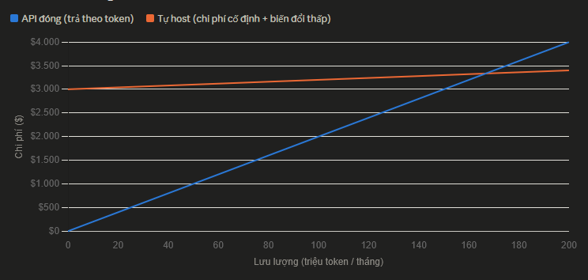
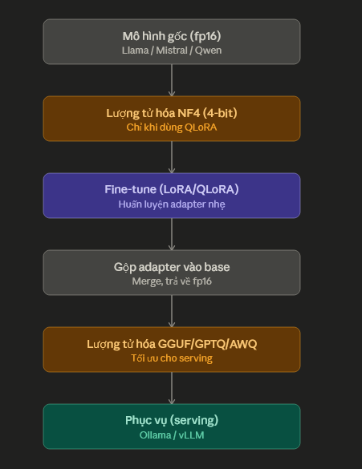

# Bài 1: Vì sao cần fine-tuning và tự host LLM? So sánh với dùng API đóng
## 1. API đóng và tự host
- API đóng:
    + Không thấy trọng số (weight) và không thay đổi được nó
    + Không thay đổi được dữ liệu đầu ra
    + Cần có mạng
    + Chi phí ban đầu gần như bằng 0 nhưng tăng dần đều theo số token
- Tự host:
    + Cần tải trọng số mô hình mã nguồn mở về
    + Chạy trên GPU của mình hoặc trên cloud
    + Mô hình và dữ liệu nằm trong tầm kiểm soát
    + Rẻ dần khi lưu lượng cao (phần lớn chi phí là chi phí cố định (mua/thuê GPU, xây hạ tầng, lương kỹ sư vận hành, license phần mềm...). Những chi phí này gần như không đổi dù bạn xử lý 1.000 hay 10 triệu request/tháng. Chi phí biến đổi thật sự (điện, băng thông) chỉ là phần rất nhỏ.)
    + Có thể tùy biến mô hình (fine-tune trọng số)

## 2. Fine-tuning là gì, và khi nào thật sự cần?
+ `Fine-tune` là việc lấy 1 pre-trained model rồi huấn luyện thêm trên dữ liệu riêng của mình để mô hình quen với phong cách, thuật ngữ, định dạng đầu ra mong muốn
+ `Fine-tune` không phải nhồi kiến thức mới vào mô hình tin cậy, đó là phần việc của `RAG`. `Fine-tune` là dạy hành vi, phong cách, định dạng.

|Nhu cầu|Công cụ|
|-------|-------|
|Đổi phong cách, giọng văn, định dạng đầu ra| Fine-tuning|
|Dạy mô hình một tác vụ hẹp lặp lại (phân loại, trích xuất)|Fine-tuning|
|Trả lời dựa trên tài liệu/dữ kiện luôn thay đổi|RAG|
|Thử nhanh một ý tưởng, prototype|	Prompt engineering trên API|
|Giảm chi phí cho tác vụ lượng lớn, ổn định|	Fine-tune mô hình nhỏ + tự host|

⚠️ __Sai lầm kinh điển:__ “Model trả lời chưa đúng, chắc phải fine-tune”. Rất nhiều lần, sửa prompt cho rõ hoặc thêm RAG là đủ - và rẻ hơn, nhanh hơn fine-tuning rất nhiều. Hãy leo thang theo thứ tự: `prompt -> few-shot -> RAG -> fine-tuning`, chỉ __fine-tune khi 3 bước trước không đủ__.

## 3. Khi nào nên dùng API, khi nào nên tự host
+ `Dưới điểm hòa vốn` (tự search cách tính) thì ưu tiên API đóng
+ Nếu `trên điểm hòa vốn` hay `cần bảo mật dữ liệu` thì tự host sẽ được ưu tiên hơn

Điểm hòa vốn (break-even point) chính là chỗ hai đường cắt nhau trên biểu đồ: dưới mức lưu lượng đó, tự host lỗ vì chưa "khai thác hết" hạ tầng đã đầu tư; vượt qua mức đó, mỗi token xử lý thêm gần như miễn phí (chỉ tốn điện), trong khi API vẫn tính tiền đều đặn theo từng token.

## 4. Một dự án tự host LLM gồm gì?

+ Lượng tử hóa NF4 (trước fine-tune) — đây chính là kỹ thuật đằng sau chữ "Q" trong QLoRA. Người ta `nén mô hình gốc xuống 4-bit trước`, rồi đóng băng nó và `chỉ huấn luyện các adapter LoRA nhỏ` (ở độ chính xác cao hơn) chồng lên trên. Mục đích: giảm VRAM cần thiết để fine-tune, cho phép train mô hình lớn trên GPU nhỏ.
+ Lượng tử hóa GGUF/GPTQ/AWQ (sau fine-tune) — sau khi train xong và gộp adapter vào mô hình gốc, người ta `nén các trọng số sau khi gộp` lại một lần nữa để mô hình chạy suy luận (inference) nhẹ và nhanh hơn khi triển khai thực tế. Mục đích: giảm chi phí và độ trễ khi phục vụ, không liên quan đến việc huấn luyện nữa.

__Ước lượng VRAM (bộ nhớ GPU) cần khi chỉ suy luận:__ $\text{số bytes mỗi tham số} \times \text{số tham số}$. Ví dụ: ở `fp32` hay ở độ chính xác `32 bit` thì mỗi tham số cần $32/8=4 \text{bytes}$ và mô hình có 7B tham số $\rightarrow 7.000.000.000 \times 4 = 28.000.000.000 \text{bytes} = 28\text{GB}$

__Bảng định dạng và số byte/tham số__

|Định dạng|Số bit|Byte/tham số|
|---------|------|------------|
|FP32|32|$32/8=4$|
|FP16|16|2|
|INT8|8|1|
|INT4|4|0.5|

Đây là lý do `lượng tử hóa (quantization)` và `QLoRA (fine-tune trên mô hình đã nén 4-bit)` quan trọng đến vậy: chúng biến “phải có GPU trung tâm dữ liệu đắt tiền” thành “chạy được trên một GPU tiêu dùng”. Còn `huấn luyện đầy đủ (full fine-tune) tốn gấp nhiều lần vì phải lưu thêm gradient và trạng thái optimizer` - đó là lý do LoRA/QLoRA gần như luôn là mặc định cho người tự host. Con số chính xác sẽ đào sâu ở các bài về lượng tử hóa và QLoRA.

## 5. Note

+ Trước khi fine-tune, luôn hỏi: prompt/few-shot/RAG đã đủ chưa? Fine-tune là bậc thang cuối, không phải đầu tiên.
+ Quyết định “API hay tự host” bằng 4 động lực: riêng tư, chi phí, kiểm soát, độ trễ - không quyết theo cảm tính.
+ Xem xét kiến trúc lai (hybrid): API cho việc khó/hiếm, mô hình tự host đã fine-tune cho việc lặp lại + nhạy cảm.
