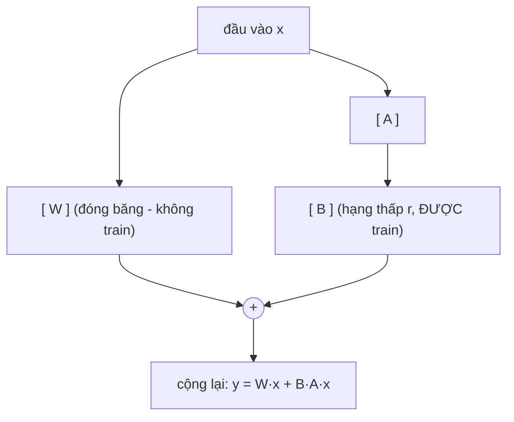
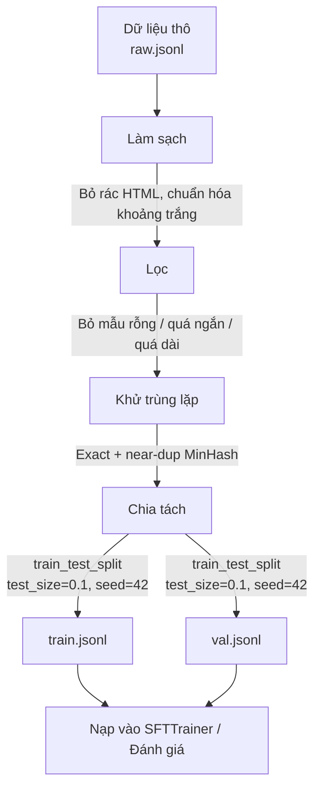
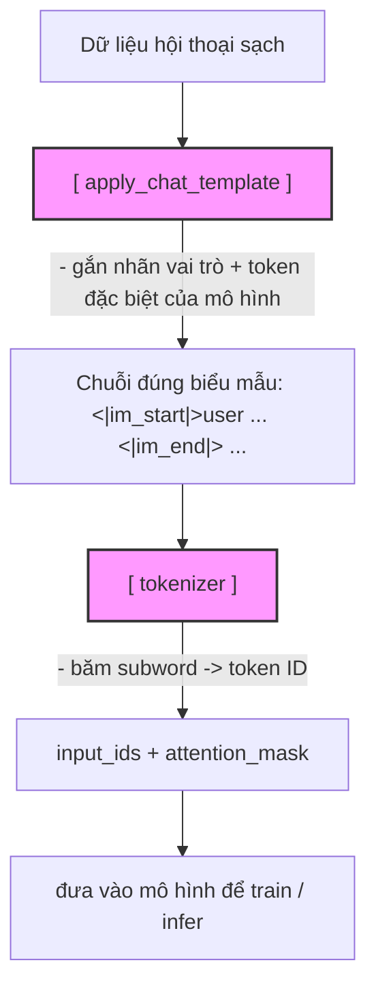

# Bài 1: Các loại fine-tuning: full fine-tune, PEFT, instruction tuning, alignment
## 1.1. PEFT và LoRA
+ `PEFT (Parameter-EfFicient Fine-Tuning)` là kĩ thuật chỉ huấn luyện 1 phần rất nhỏ các tham số, `đóng băng` gần như toàn bộ trọng số gốc
+ `LoRA` là kĩ thuật nổi tiếng nhất của `PEFT`

$W' = W + \Delta W = W + BA$

Với:
+ $B$ và $A$ và 2 ma trận phân rã
+ Nếu $W$ có kích thước $d \times k$ thì `B` là $d \times r$ và `A` có kích thước là $r \times k$ với `rank` $r$ rất nhỏ (thường 8, 16, 32) và $r<<min(d, k)$
+ Số tham số train giảm cả trăm lần

Cơ chế LoRA (chỉ B và A được huấn luyện):



+ Chúng ta tối ưu $\Delta W$ bởi $\frac{\alpha}{r}$ ($\alpha$ là biến `lora_alpha` trong `LoraConfig` đóng vai trò như `learning rate`)
+ `target_modules` là các lớp được gắn adapter (theo __paper__ thì gắn vào vector $Q$ và vector $V$ cho ra kết quả tốt nhất)

+ QLoRA: nạp model gốc đã được lượng tử hóa rồi mới gắn LoRA lên trên

## 1.2. Instruction tuning (SFT): dạy model nghe lệnh làm đúng nhiệm vụ
+ Model pre-train chỉ có thể đoán được từ tiếp theo chứ chưa quan nghe lệnh (Ví dụ: "Hãy viết 1 email")
+ `Instruction tuning` (SFT - Supervised Fine-Tuning): huấn luyện model trên các cặp `(chỉ dẫn, câu trả lời)

## 1.3. Alignment (DPO/RLHF): dạy model các cư xử như người
+ SFT: chưa đảm bảo model cho ra output ưng ý con người dù output đấy đúng
+ RLHF (Reinforcement Learning from Human Feedback): cần train thêm reward model
+ DPO (Direct Preference Optimization): học trực tiếp từ (câu ưa thích, câu bị chê) và không cần reward model

## 1.4. Note
❌ “Làm DPO thì bỏ qua SFT cho nhanh.” → ✅ Sai thứ tự. Nên SFT trước rồi mới alignment.

# Bài 2: Chuẩn bị dữ liệu huấn luyện: định dạng instruction và chat
Tưởng tượng bạn thuê một gia sư siêu giỏi (model nền đã pretrain) về dạy kèm. Gia sư này biết cực nhiều, nhưng nói lan man, hỏi một trả lời mười, đôi khi lạc đề. Việc của bạn là đưa cho gia sư một cuốn sổ tay ghi rõ: “Khi học sinh hỏi kiểu này, hãy trả lời kiểu này”. Cuốn sổ tay đó chính là dataset huấn luyện. Fine-tune giỏi hay dở, 80% nằm ở chất lượng cuốn sổ này, chứ không phải ở thuật toán.

## 2.1. Chat template
Mỗi model có 1 chat template riêng. Ví dụ:

   ChatML (Qwen va nhieu model open):<br>
   <|im_start|>system ... <|im_end|><br>
   <|im_start|>user ... <|im_end|><br>
   <|im_start|>assistant ... <|im_end|><br>

   Llama 3 (định dạng riêng của Meta):<br>
   <|begin_of_text|><|start_header_id|>system<|end_header_id|> ... <|eot_id|><br>
   <|start_header_id|>user<|end_header_id|> ... <|eot_id|><br>

Thay vì tự ghép bằng tay thì ta để `tokenizer` tự lo bằng cách sử dụng `apply_chat_template()`

## 2.2. Loss masking: chỉ chấm bài trên phần assistant nói
SFTTrainer hỗ trợ điều này qua tham số assistant_only_loss (khi dataset ở định dạng chat và chat template có đánh dấu vùng assistant). Bật nó lên giúp model tập trung học cách trả lời, không phí công học lại câu hỏi.

# Bài 3: Chất lượng dữ liệu
## 3.1. Ví dụ về clean data
Lấy content trong các tag của HTML $\rightarrow$ lọc bỏ các mẫu rỗng, quá ngắn (thường là vô nghĩa) hoặc quá dài (tốn token, vượt context)

## 3.2. Khử trùng lặp
Có 2 loại dedup:
+ Exact dedup: hai mẫu có kí tự giống hệt nhau
+ Near-dedup: dựa trên similarity

### Near-dedup
Ở đây sử dụng `MinHash`

Thuật toán `MinHash`:
+ Dùng để ước lượng nhanh độ tương tự Jaccard giữa 2 tập hợp lớn mà không cần so sánh trực tiếp
+ Jaccard: $J(A,B)=\frac{|A\cap B|}{|A\cup B|}$
+ Hàm băm $H(x)=ax+b$ với $a, b$ là 2 tham số ngẫu nhiên thay đổi qua từng lần chạy

Quy trình:
1. Tạo tập hợp từ văn bản (Shingling): tách văn bản thành tập hợp với các thành phần có $k$ phần tử. Ví dụ câu: `con mèo trèo cây cau` với $k=2$ ta sẽ có: `{con mèo, mèo trèo, trèo cây, cây cau}`. Hàm băm: $h_{min}(A)=\min_{x\in A}h_i(x)$. Tính chất: $P(h_{min}(A)=h_{min}(B))=J(A,B)$
2. Tạo ma trận đặc trưng: là ma trận có kiểu như hình dưới


3. ???????????????????????????????????


### Note
Với các dataset nhỏ (dưới vài nghìn dòng) thì chỉ cần exact dedup là đủ

## 3.3. Quy trình chung cho xử lý dữ liệu huấn luyện


|Tỉ lệ split thường dùng|Use case|
|-----------------------|--------|
|90-10|Mặc định phổ biến cho fine-tune LLM|
|95-5|Dataset lớn, muốn tận dụng tối đa cho train|
|80-20|Dataset nhỏ, cần validation đủ mẫu để tin cậy|

Luôn đặt `seed` cố định để mỗi lần chạy chia y hệt nhau - điều kiện tiên quyết để so sánh công bằng (reproducibility).

SAI:  raw -> split -> dedup(train), dedup(val) (bản trùng giữa train và val vẫn lọt -> LEAKAGE)

ĐÚNG: raw -> clean -> DEDUP toàn bộ -> SPLIT (đã bỏ trùng trên toàn tập trước khi tách)

# Bài 4: Tokenization và chat template: đưa dữ liệu về đúng định dạng mô hình
Trước khi vào mô hình, mọi câu chữ phải được tokenize - băm nhỏ thành các mảnh (token) và đổi thành `những con số (token ID)`. Và khi `fine-tune` một mô hình chat, dữ liệu hội thoại phải được xếp vào đúng `chat template` - biểu mẫu mà mô hình được huấn luyện để nhận diện đâu là lời người dùng, đâu là lời trợ lý.

## 4.1. Một số khái niệm
|Khái niệm|Định nghĩa|Ví dụ|
|---------|----------|-----|
|Token|Là mảnh văn bản nhỏ nhất mà mô hình xử lý|token, _init, ##ppy|
|Token ID|Số nguyên đại diện cho token trong từ điển||
|Vocabulary|Toàn bộ tập token mà mình biết||
|Context length|Giới hạn token chứ không phải theo chữ||

Quy tắc nhẩm thô cho tiếng Anh: khoảng 1 token xấp xỉ 4 ký tự (khoảng 0,75 từ). Tiếng Việt/tiếng có dấu thường tốn token hơn - __hãy luôn đo bằng chính tokenizer của mô hình, đừng đoán.__

## 4.2. Subword tokenization (BPE)
+ Nếu tách theo từng từ nguyên vẹn thì từ điển sẽ trở nên khổng lồ và luôn gặp từ lạ chưa từng thấy.
+ Giải pháp ở đây là `subword` - chia thành các mảnh con hay gặp
+ BPE (Byte-Pair Encoding) là thuật toán phổ biến nhất. Bắt đầu từ ký tự, rồi liên tục gộp cặp hay đi cùng nhau nhất thành token mới, cho tới khi đủ kích thước từ điển.

<a src="https://www.geeksforgeeks.org/nlp/byte-pair-encoding-bpe-in-nlp/">Tìm hiểu thêm về cách hoạt động ở đây</a>

## 4.3. Chat template
+ Đây là phần cốt lõi của fine-tuning mô hình chat
+ Mô hình `Instruct` là mô hình được huấn luyện với 1 định dạng đánh dấu vai trò riêng: đâu là lời gọi hệ thống (system), người dùng (user), trợ lý (assistant). Ví dụ `<|user_start|>Hello<|user_end|>`
+ Mỗi mô hình có 1 template riêng cho nên việc ghép request, response, etc. với các đánh dấu 1 cách thủ công là 1 việc bất khả thi.
+ Dùng hàm `apply_chat_template()` để cho tokenizer làm vì template đã được nhúng sẵn trong tokenizer đi kèm.

+ `apply_chat_template()` nên được cấu trúc như một `list các dictionary` với `role` và `content`
+ Các role:
    + `user`: cho message của user
    + `assistant`: cho message của mô hình
    + `system`: __thường được đặt ở đầu__ để hướng dẫn mô hình

Ví dụ:
```
<|im_start|>system
You are a helpful assistant.<|im_end|>
<|im_start|>user
Who won the world series in 2020?<|im_end|>
<|im_start|>assistant
The Los Angeles Dodgers won the World Series in 2020.<|im_end|>
<|im_start|>user
Where was it played?<|im_end|>
<|im_start|>assistant
```



## 4.4. `add_generation_prompt`: train khác infer
Tùy vào train hay inference thì cờ `add_generation_prompt` sẽ được bật hoặc tắt

|Tình huống|`add_generation_prompt`|Lí do|
|-|-|-|
|Inference|`True`|Thêm phần mở đầu để mô hình biết "đến lượt mô hình trả lời"|
|Training|`False`|Câu trả lời của assistant đã có sẵn trong data rồi, không cần chừa chỗ trống|

## 4.5. Special token, EOS và loss masking
### Special token
|Special token|Vai trò|Hậu quả nếu thiếu|
|-|-|-|
|BOS (begin of sequence)|Đánh dấu bắt đầu chuỗi|Một số mô hình lệch định dạng|
|EOS (end of sequence)|Đánh dấu kết thúc câu trả lời|Mô hình “nói mãi không dừng” khi infer|
|PAD (padding)|Chèn cho đủ độ dài khi gom batch|Không gom batch được gây lỗi lúc training|

Với nhiều mô hình chat, EOS thường trùng token kết thúc lượt (vd <|im_end|>) và apply_chat_template đã tự thêm. Tự nối chuỗi thủ công rất dễ quên EOS -> mô hình sau train sinh văn bản lê thê không biết dừng.

### Loss masking
+ Dùng để cho mô hình __không__ học cách thuộc câu hỏi của người dùng mà để mô hình học viết __phần trả lời của assistant__
+ Cách làm là đặt nhãn (label) của các token phần prompt/user thành -100 để hàm mất mát (loss) bỏ qua

```
input_ids: [BOS] [user] Explain QLoRA . [assistant] QLoRA is ... efficient . [EOS]
labels:    -100  -100   -100    -100  -100  -100      QLoRA  is  ... efficient . [EOS]
```

+ dùng TRL SFTTrainer với dữ liệu chat, bạn thường không phải làm tay việc này - SFTTrainer tự áp chat template và (với cấu hình phù hợp) mask phần không phải câu trả lời. Ta ráp trainer đầy đủ ở bài sau; ở đây chỉ cần hiểu bản chất.


Sai lầm kinh điển số một khi tự host và fine-tune là train một template, phục vụ một template khác. Bạn fine-tune bằng template của Qwen, rồi mang GGUF sang Ollama nhưng file Modelfile khai báo template khác -> mô hình trả lời lung tung dù train rất kỹ. Template là “hợp đồng” giữa lúc train và lúc serve, phải nhất quán từ đầu tới cuối chuỗi (data -> train -> merge -> quantize -> Ollama/vLLM).

# Bài 5: Chọn siêu tham số huấn luyện (learning rate, epoch, batch size)
## 5.1. Learning rate
Là kích thước mỗi bước điều chỉnh trọng số theo hướng giảm loss

|LR thấp (ví dụ 1e-6)|LR vừa (1e-4...3e-4)|LR cao (ví dụ 1e-2)|
|-|-|-|
|Loss giảm chậm|Loss giảm mượt, ổn định|Loss nhảy loạn|
|Tốn nhiều GPU|Hội tụ trong ít epoch|Mô hình quên kiến thức gốc|
|Nguy cơ underfitting|Kết quả tốt nhất|Fine-tuning coi như hỏng|

Với `LoRA/QLoRA`, learning rate thường trong khoảng `1e-4` đến `3e-4` (mặc định hay dùng là `2e-4`). Với `full fine-tune` (cập nhật toàn bộ trọng số) thì LR phải NHỎ hơn nhiều, cỡ `1e-5` đến `5e-5` - vì đụng trọng số gốc nên phải đi cực nhẹ để không phá kiến thức pretrained.

## 5.2. Warmup và scheduler: khởi động rồi giảm dần
+ Trong đầu quá trình training, gradient còn nhiễu, nếu dùng learning rate cao dễ làm loss bùng. `Warmup` cho learning rate tăng dần từ 0 lên giá trị đích trong vài phần trăm bước đầu.
+ Sau warmup, scheduler giảm dần learning rate về cuối để "hạ cánh" mượt mà.

```
   Learning rate theo thời gian (scheduler = cosine + warmup)
   LR
    ^
2e-4|          .-''''''''''-.
    |        .'              '-.
    |      .'                   '-.__
    |    .'                          '''--..___
    |  .'                                      '''----
   0+--+---------------------------------------------> step
      warmup (3%)        LR giảm dần (cosine) về gần 0

```

|Scheduler|Hành vi|Khi nào dùng|
|-|-|-|
|`constant`|LR giữ nguyên xuyên suốt quá trình|Debug nhanh, run ngắn|
|`linear`|Giảm tuyến tính về 0|Mặc định đơn giản|
|`consine`|Giảm theo đường cong cosine|Phổ biến cho fine-tune LLM|

Cấu hình quen thuộc: `lr_scheduler_type="cosine"` + `warmup_ratio=0.03` (khởi động trong 3% tổng số bước). Đây là combo an toàn cho phần lớn dự án SFT.

## 5.3. Epoch và step
+ 1 epoch là 1 lần mô hình "nhìn" qua <u><b>toàn bộ</b></u> dataset đúng 1 lần. 
+ 1 step là 1 lần cập nhật trọng số

Nếu train quá nhiều epoch thì mô hình sẽ học vẹt từng câu thay vì học quy luật. Dấu hiệu cho vấn đề này là `training loss vẫn giảm nhưng validation loss lại bắt đầu tăng`
```
   Loss
   ^
   |  \                       ___ validation loss (bắt đầu tăng -> overfit)
   |   \                  ___/
   |    \____________  __/   <- điểm nên DỪNG (early stopping)
   |                 \/  \___________ training loss (vẫn giảm)
   +----------------------------------------> epoch
                 e1   e2   e3   e4   e5

```

|Số epoch|Rủi ro|Ghi chú|
|-|-|-|
|< 1 (1 phần dữ liệu)|Underfit, học chưa đủ|Chỉ hợp khi dataset rất lớn|
|1-3|Nên dùng chp SFT|Đa số dự án instruction-tuning dùng ở khoảng này|
|> 5|Nguy cơ overfit cao|Chỉ khi dataset nhỏ và cần theo dõi kỹ eval|

## 5.4. Batch size và gradient accumulation: gộp bao nhiêu mẫu mỗi bước
+ `batch`: thay vì cứ đưa training example (từng conversation) vào model rồi cập nhật trọng số theo từng conversation thì ta gộp nhiều example lại thành 1 batch rồi `forward + backward` cùng lúc. Điều này giảm độ loạn của gradient và có thể tận dụng GPU tốt hơn (tính toán song song)
+ `Batch size`: là số mẫu mô hình xử lý trước khi cập nhật trọng số 
+ GPU chỉ có thể nhét được `per_device_train_batch_size=2` hoặc 4. 
+ Muốn có batch hiệu dụng lớn mà không cần thêm VRAM, ta dùng `tích lũy gradient (gradient accumulate)` qua nhiều micro-batch rồi cập nhật 1 lần

$\text{effective batch} = \text{per\_device\_batch} \times \text{grad\_accum\_steps} \times \text{n\_gpus}$

Với:
+ `per_device_batch`: số sample xử lý trong 1 lần forward, backward trên 1 GPU
+ `grad_accum_steps`: số bước cộng dồn gradient trước khi update trọng số
+ `effective_batch`: số example thực sự đóng góp vào 1 lần update trọng số (1 optimizer.step())

Ví dụ: per_device_train_batch_size=2, gradient_accumulation_steps=8, 1 GPU -> effective batch = 2×8=16. Mô hình “cảm nhận” như đang train với batch 16 nhưng chỉ tốn VRAM của batch 2 vì tại bất kỳ thời điểm nào, GPU chỉ cần giữ trong bộ nhớ:
+ Activations của 2 example (không phải 16)
+ Gradient tạm thời của 2 example

Khi thiếu VRAM: giảm `per_device_train_batch_size`, tăng `gradient_accumulation_steps` để giữ nguyên `effective batch`. Đây là mẹo sống còn khi fine-tune trên GPU consumer (vd một card 16GB).

## 5.5. Note
```
model = AutoModelForCausalLM.from_pretrained(model_id, quantization_config=bnb_config, device_map="auto")
```

Để áp dụng QLoRA thì chỉ cần thêm parameter `quantization_config` với ví dụ config như dưới
```
# 4-bit quantization to fit the base model into limited VRAM (QLoRA)
bnb_config = BitsAndBytesConfig(
    load_in_4bit=True,
    bnb_4bit_quant_type="nf4",
    bnb_4bit_compute_dtype=torch.bfloat16,
)
```