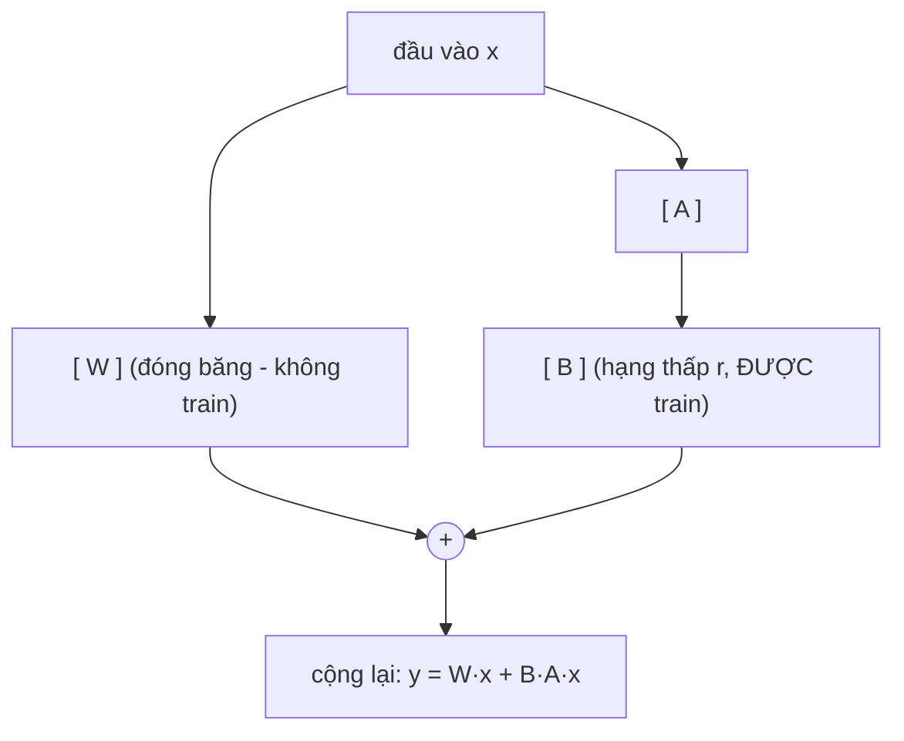

# Bài 1: Các loại fine-tuning: full fine-tune, PEFT, instruction tuning, alignment
## 1.1. PEFT và LoRA
+ `PEFT (Parameter-EfFicient Fine-Tuning)` là kĩ thuật chỉ huấn luyện 1 phần rất nhỏ các tham số, `đóng băng` gần như toàn bộ trọng số gốc
+ `LoRA` là kĩ thuật nổi tiếng nhất của `PEFT`

$W' = W + \Delta W = W + BA$

Với:
+ $B$ và $A$ và 2 ma trận phân rã
+ Nếu $W$ có kích thước $d \times k$ thì `B` là $d \times r$ và `A` có kích thước là $r \times k$ với `rank` $r$ rất nhỏ (thường 8, 16, 32) và $r<<min(d, k)$
+ Số tham số train giảm cả trăm lần

Cơ chế LoRA (chỉ B và A được huấn luyện):

+ Chúng ta tối ưu $\Delta W$ bởi $\frac{\alpha}{r}$ ($\alpha$ là biến `lora_alpha` trong `LoraConfig` đóng vai trò như `learning rate`)
+ `target_modules` là các lớp được gắn adapter (theo __paper__ thì gắn vào vector $Q$ và vector $V$ cho ra kết quả tốt nhất)

+ QLoRA: nạp model gốc đã được lượng tử hóa rồi mới gắn LoRA lên trên

## 1.2. Instruction tuning (SFT): dạy model nghe lệnh làm đúng nhiệm vụ
+ Model pre-train chỉ có thể đoán được từ tiếp theo chứ chưa quan nghe lệnh (Ví dụ: "Hãy viết 1 email")
+ `Instruction tuning` (SFT - Supervised Fine-Tuning): huấn luyện model trên các cặp `(chỉ dẫn, câu trả lời)

## 1.3. Alignment (DPO/RLHF): dạy model các cư xử như người
+ SFT: chưa đảm bảo model cho ra output ưng ý con người dù output đấy đúng
+ RLHF (Reinforcement Learning from Human Feedback): cần train thêm reward model
+ DPO (Direct Preference Optimization): học trực tiếp từ (câu ưa thích, câu bị chê) và không cần reward model

## 1.4. Note
❌ “Làm DPO thì bỏ qua SFT cho nhanh.” → ✅ Sai thứ tự. Nên SFT trước rồi mới alignment.

# Bài 2: Chuẩn bị dữ liệu huấn luyện: định dạng instruction và chat
Tưởng tượng bạn thuê một gia sư siêu giỏi (model nền đã pretrain) về dạy kèm. Gia sư này biết cực nhiều, nhưng nói lan man, hỏi một trả lời mười, đôi khi lạc đề. Việc của bạn là đưa cho gia sư một cuốn sổ tay ghi rõ: “Khi học sinh hỏi kiểu này, hãy trả lời kiểu này”. Cuốn sổ tay đó chính là dataset huấn luyện. Fine-tune giỏi hay dở, 80% nằm ở chất lượng cuốn sổ này, chứ không phải ở thuật toán.

## 2.1. Chat template
Mỗi model có 1 chat template riêng. Ví dụ:

   ChatML (Qwen va nhieu model open): 
   <|im_start|>system ... <|im_end|> 
   <|im_start|>user ... <|im_end|> 
   <|im_start|>assistant ... <|im_end|> 

   Llama 3 (định dạng riêng của Meta): 
   <|begin_of_text|><|start_header_id|>system<|end_header_id|> ... <|eot_id|> 
   <|start_header_id|>user<|end_header_id|> ... <|eot_id|> 

Thay vì tự ghép bằng tay thì ta để `tokenizer` tự lo bằng cách sử dụng `apply_chat_template()`

## 2.2. Loss masking: chỉ chấm bài trên phần assistant nói
SFTTrainer hỗ trợ điều này qua tham số assistant_only_loss (khi dataset ở định dạng chat và chat template có đánh dấu vùng assistant). Bật nó lên giúp model tập trung học cách trả lời, không phí công học lại câu hỏi.