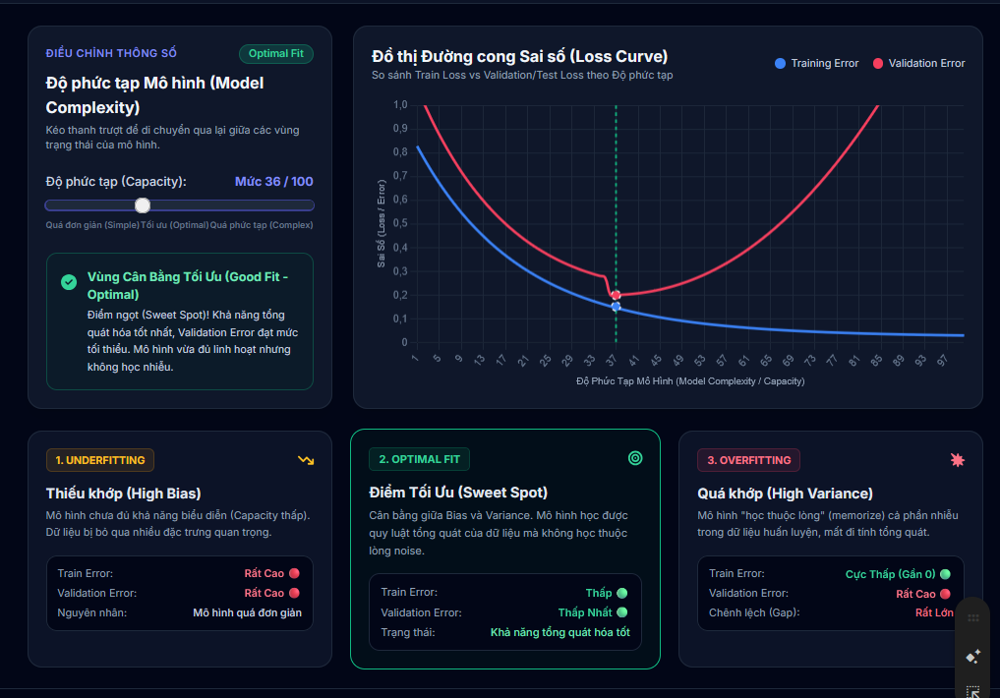
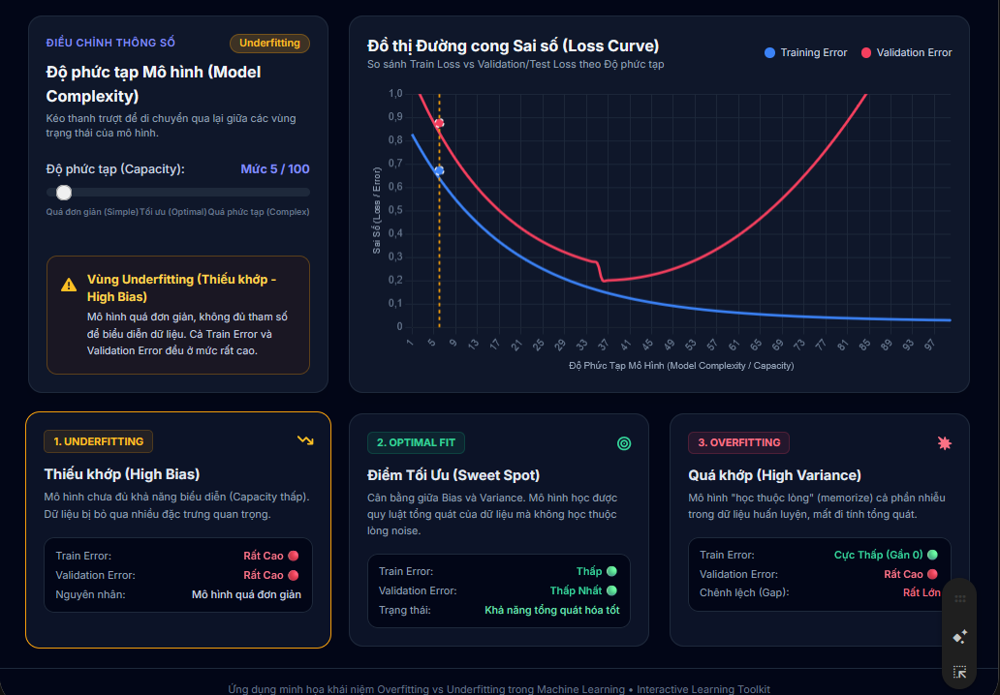
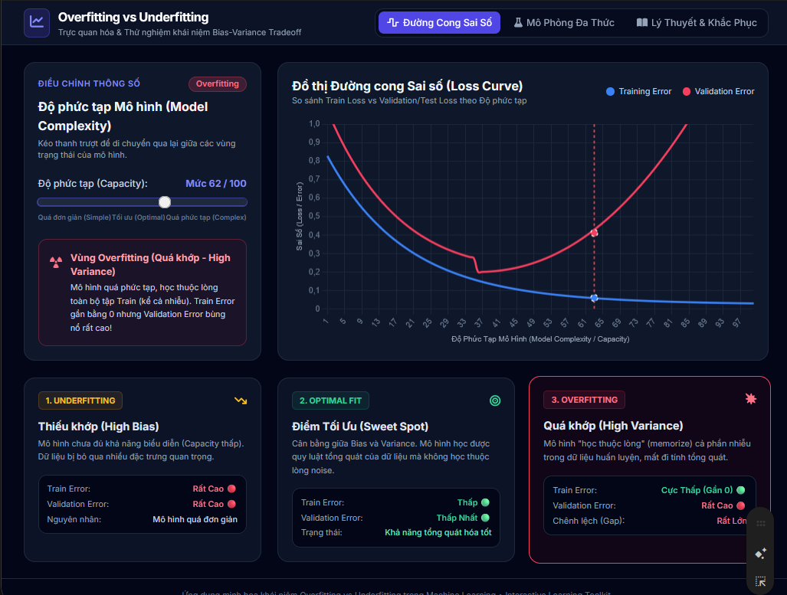
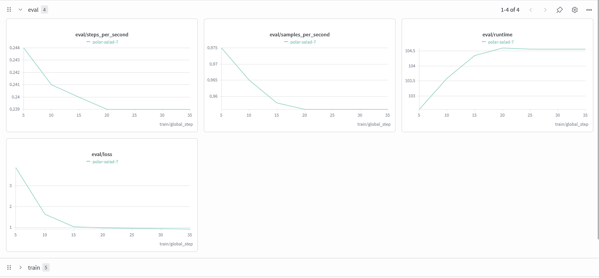

# Bài 1: LoRA là gì? Cơ chế low-rank adaptation giúp fine-tune tiết kiệm
## 1.1. Giải thích cấu hình LoRA
+ `r`: hạng của cặp ma trận LoRA, có thể 16, 32 nếu các tác vụ phức tạp
+ `lora_alpha`: thường bằng $\alpha=2r$ do quy ước phổ biến $\frac{\alpha}{r}=2$
+ `lora_dropout`: bỏ ngẫu nhiên 1 số lượng phần trăm để giảm overfiting trên dataset nhỏ
+ `task_type`:
    + `SEQ_CLS`: text classification
    + `SEQ_2_SEQ_LM`: Sequence-to-sequence language modeling.
    + `CAUSAL_LM`: Causal language modeling. (decoder only)
    + `TOKEN_CLS`: Token classification.
    + `QUESTION_ANS`: Question answering.
    + `FEATURE_EXTRACTION`: Feature extraction. Provides the hidden states which can be used as embeddings or features for downstream tasks.

Nhưng cần hiểu chính xác một điều dễ nhầm: model gốc vẫn phải nằm trong VRAM ở dạng đầy đủ (vd 14 GB cho 7B ở 16-bit) để tính forward pass. LoRA chỉ cắt phần optimizer + gradient của trọng số gốc, KHÔNG làm nhỏ bản thân model gốc. Nếu nạp model gốc cũng đã vượt VRAM, bạn cần thêm mẹo lượng tử hóa 4-bit - chính là QLoRA, chủ đề bài kế tiếp: LoRA lo chi phí train, QLoRA lo nốt chi phí nạp model.

# Bài 2: QLoRA: fine-tune trên GPU nhỏ nhờ lượng tử hóa 4-bit
## 2.1. はがき
LoRA thường vẫn phải nạp model gốc ở 16-bit vào VRAM - với model 7B riêng cái đó đã ngốn ~14 GB, chưa kể optimizer và activation. GPU 8 GB của bạn chào thua.

QLoRA (Quantized LoRA) vá đúng lỗ hổng này: nó nén model gốc xuống còn 4-bit để nhét vừa GPU nhỏ, rồi vẫn gắn adapter LoRA lên trên để fine-tune. Kết quả: bạn fine-tune được một model 7B ngay trên GPU consumer (card 12-16 GB, thậm chí Colab free), điều mà trước đây phải thuê cụm GPU đắt đỏ mới làm nổi.

Một câu để nhớ: QLoRA = đóng băng + nén model gốc xuống 4-bit (để vừa VRAM) rồi train adapter LoRA nhẹ ở 16-bit trên đó - fine-tune model lớn trên GPU bé mà chất lượng gần như không giảm.

Nén 4-bit KHÔNG phải “cắt bớt não model”. Trọng số vẫn đủ, chỉ được biểu diễn thô hơn; cái hay của QLoRA là phần thô đó được bù lại bằng adapter LoRA train ở 16-bit.

## 2.2. Cốt lõi của QLoRA
|Kỹ thuật|Giải thích|Lợi ích|
|-|-|-|
|NF4 (Normal float 4-bit)|Kiểu dữ liệu 4 bit được thiết kế riêng cho trọng số có phân bố chuẩn|Nén 4 bit mà sai số nhỏ hơn `int4` thông thường|
|Double quantization| Lượng tử hóa cả hằng số lượng tử thêm 1 lần nữa|Tiết kiệm được khoảng 0.4bit/tham số|
|Paged optimizer|Dùng bộ nhớ hợp nhất (unified memory) của NVIDIA để “phân trang” state của optimizer khi VRAM sắp tràn|Chống lỗi out-of-memory lúc gặp batch dài đột biến|

```
   Model gốc 7B (16-bit, ~14 GB)
            |
            v   NÉN xuống NF4 (double quantization)
   Model gốc NF4 4-bit (~3.5 GB, ĐÓNG BĂNG - không train)
            |
            +--- gắn adapter LoRA (B, A) ở 16-bit  <- CHỈ train phần này
            |
            v
   Lan truyền ngược (backprop) chảy QUA model 4-bit,
   nhưng CHỈ cập nhật trọng số của adapter LoRA
```

## 2.3. Quy trình
```
BitsAndBytesConfig 4-bit 
          |
          v
from_pretrained nạp model 4-bit
          |
          v
prepare_model_for_kbit_training
          |
          v
LoraConfig + get_peft_model gắn adapter
          |
          v
Trainer/SFTTrainer.train() chỉ train adapter
          |
          v
save_pretrained lưu adapter nhẹ.
```
`prepare_model_for_kbit_training(model)`: bước không được quên. Nó ép layer norm về fp32 cho ổn định số, bật gradient checkpointing để tiết kiệm VRAM, và cho phép gradient chảy tới adapter. Quên bước này -> loss thường không giảm hoặc lỗi.

 Sau train, save_pretrained chỉ lưu adapter (thường vài chục MB), KHÔNG lưu lại cả model 7B. Khi dùng lại, bạn nạp model gốc rồi “dán” adapter lên. Chuyện merge adapter vào model và chạy inference sẽ học kỹ ở Bài 3 và các bài serving sau.

# Note
Card T4 chỉ train quanh quanh 0.0x it/s nên làm project thì chịu khó xì tiền ra thôi

# Bài 4: Theo dõi huấn luyện: loss, overfitting và Weights & Biases
## 4.1. Loss
|Thuật ngữ|Ý nghĩa|Mong muốn|
|-|-|-|
|Train loss|Sai số trên tập huấn luyện|Giảm dần, mượt|
|Validation loss|Sai số trên tập kiểm định|Giảm dần theo train loss|

## 4.2. Đường cong overfitting và underfitting
### Học tổt
+ Cả 2 loss cùng giảm và bám sát nhau



### Underfitting
+ Cả 2 loss đề đang rất cao, giảm chậm
+ Do rank LoRA quá nhỏ, learning rate quá thấp hoặc train quá ít



### Overfitting
+ Training loss vẫn giảm nhưng validation loss chững lại rồi tăng trở lại


## 4.3. Weights & Biases: bảng đồng hồ tự động, chia sẻ được
+ Weight & Biases là dịch vụ ghi lại log và trực quan hóa huấn luyện
+ Mọi metric sẽ được đẩy lên dashboard web
+ <a src="https://wandb.ai/site">Cài đặt và đăng nhập</a>

Điều tuyệt vời với Hugging Face: không cần viết code logging thủ công. Chỉ cần thêm report_to="wandb" vào chính SFTConfig ở mục 3, trainer tự đẩy mọi metric lên W&B:

Chỉ cần cài pip `wandb` và chạy `wandb login` rồi thêm `report_to="wandb"` và thêm `dataset_text_field = "text",` vào `SFTConfig` là xong


Ví dụ dashboard của weight and bias

## 4.4. Early stopping: dừng đúng lúc trước khi học vẹt
+ Dùng để dừng quá trình train ngay trước khi gặp overfitting
+ Hugging Face có sẵn EarlyStoppingCallback: nếu val loss không cải thiện sau một số lần đánh giá liên tiếp, trainer tự dừng.
+ Kết hợp `EarlyStoppingCallback` với `load_best_model_at_end=True` là bộ đôi kinh điển: trainer vừa dừng khi hết cải thiện, vừa nạp lại checkpoint tốt nhất - không bao giờ vô tình giữ model đã overfit ở cuối.

```
from transformers import EarlyStoppingCallback

trainer = SFTTrainer(
    model=model,
    args=training_args,
    train_dataset=dataset["train"],
    eval_dataset=dataset["validation"],
    # Stop if eval_loss does not improve for 3 consecutive evaluations
    callbacks=[EarlyStoppingCallback(early_stopping_patience=3)],
)
trainer.train()
```
`early_stopping_patience` là số lần đánh giá (eval), không phải số bước train. Nó chỉ có tác dụng khi đã bật eval_strategy="steps" và metric_for_best_model="eval_loss".

# Bài 5: Gộp adapter (merge), lưu và chia sẻ mô hình lên Hugging Face Hub
+ LoRA chỉ sinh ra adapter, không phải cả mô hình
## 5.1. Khi nào merge adapter, khi nào giữ tách rời
|Tiêu chí|Giữ adapter tách rời|Merge vào base|
|-|-|-|
|Dung lượng lưu|Rất nhỏ|Bằng cả mô hình gốc|
|Đổi/gộp nhiều adapter|Dễ|Không thể vì nó đã fix cứng vào model|
|Độ trễ suy luận|Thêm 1 chút overhead cho $BA$|Nhanh nhất|
|Chuyển sang GGUF/Ollama/vLLM|Thường phải merge trước|Có thể chuyển đổi ngay|
|Phù hợp khi|Còn thử nghiệm hoặc có nhiều task khác nhau|Production|
## 5.2. Merge adapter vào base bằng `merge_and_unload()`
+ Không được merge trên trọng số 4-bit
+ Đừng quên tokenizer

```
import torch
from transformers import AutoModelForCausalLM, AutoTokenizer
from peft import PeftModel

BASE_MODEL = "meta-llama/Llama-3.2-3B-Instruct"   # the frozen base model
ADAPTER_DIR = "./outputs/lora-adapter"            # folder produced by SFTTrainer

# 1) Load the base model in fp16 (merging must NOT be done in 4-bit / quantized weights)
base = AutoModelForCausalLM.from_pretrained(
    BASE_MODEL,
    torch_dtype=torch.float16,
    device_map="auto",
)

# 2) Attach the trained LoRA adapter on top of the base model
model = PeftModel.from_pretrained(base, ADAPTER_DIR)

# 3) Fold B*A into W and drop the LoRA layers -> a plain standalone model
merged = model.merge_and_unload()

# 4) Save the merged model in the safetensors format (safe + fast to load)
merged.save_pretrained("./llama-3.2-3b-mytune-merged", safe_serialization=True)

# 5) The tokenizer MUST be saved next to the model, otherwise it is unusable
tokenizer = AutoTokenizer.from_pretrained(BASE_MODEL)
tokenizer.save_pretrained("./llama-3.2-3b-mytune-merged")
```

