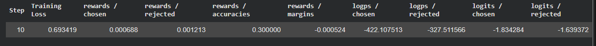

# Bài 1: Đánh giá mô hình sau fine-tune: benchmark và LLM-as-judge
## 1.1. Benchmark tự động và LLM-as-judge
|Tiêu chí|Benchmark tự động|LLM-as-judge|
|-|-|-|
|Loại tác vụ|Có đáp án|Nhiều câu trả lời đúng|
|Cách đánh giá|So khớp hoặc tính accuracy|Dùng 1 LLM mạnh hơn để chấm theo rubric|
|Tính khách quan trong quy trình đánh giá|Có thể có bias của LLM judge|
|Ví dụ|MMLU, GSM8K, HellaSwag|Chấm chatbot|

+ `Rubric`: Rubric là một công cụ đánh giá chỉ rõ các tiêu chí đạt được trên tất cả các nhiệm vụ của sinh viên, từ nhiệm vụ bằng văn bản đến nhiệm vụ bằng miệng và nhiệm vụ trực quan. Nó có thể được sử dụng để chấm điểm đối với bài tập, sự tham gia lớp học hoặc điểm tổng kết. Có hai loại đánh giá theo tiêu chí: tổng thể và chi tiết.

## 1.2. Benchmark tự động với lm-evaluation-harness
```
# Install the harness from the official EleutherAI repo
pip install lm-eval

# Evaluate a local/HF model on MMLU (5-shot). --model hf = HuggingFace backend
lm_eval --model hf \
  --model_args pretrained=./my-merged-model,dtype=bfloat16 \ 
  --tasks mmlu \
  --num_fewshot 5 \
  --batch_size 8 \
  --output_path results/mmlu_finetuned.json
```
Với:
+ `--model_args pretrained=...`: trỏ tới thư mục model đã merge của bạn (hoặc repo trên Hub)
+ `--tasks`: chọn bộ test. Có thể liệt kê nhiều bộ test bằng cách phân tách bằng dấu `,` `mmlu,gsm8k,hellaswag`
+ `--num_fewshot`: số lượng mẫu ví dụ mà model được xem

Các bộ test:
+ `mmlu`: 
    + Đánh giá kiến thức tổng quan và suy luận trên nhiều lĩnh vực
    + Cấu trúc là dạng trắc nghiệm từ nhiều chủ đề như toán, sử, ...
    + Độ khó: trung học đến chuyên gia
    + Là một trong những benchmark "must-have" khi so sánh các mô hình lớn (GPT, Claude, Gemini, Llama...).
+ `GSM8K` (Grade School Math 8K):
    + Đánh giá khả năng suy luận toán học nhiều bước
    + Các bài toán tiểu học/THCS cần > 2 bước tính toán
    + Cách chấm: Accuracy trên đáp số cuối cùng, thường dùng kỹ thuật "chain-of-thought" (giải thích từng bước) để cải thiện kết quả.
+ `hellaswag`:
    + Đánh giá khả năng suy luận thông thường và hiểu ngữ cảnh
    + Cấu trúc: Cho một đoạn mô tả tình huống, mô hình phải chọn ra câu kết thúc hợp lý nhất trong 4 lựa chọn.
    + Điểm đặc biệt: Các câu nhiễu (distractors) được tạo bằng phương pháp "Adversarial Filtering" — trông có vẻ hợp lý về mặt cú pháp nhưng vô lý về logic thực tế, khiến các mô hình yếu dễ bị đánh lừa dù người thường thấy rất dễ.
    + Cách chấm: Accuracy trong việc chọn đúng câu kết thúc.

# Bài 2: Quantization sau huấn luyện: GPTQ, AWQ và bitsandbytes
## 2.1. Quantization từ float16 về int4
+ `Quantization` ánh xạ trọng số đang ở số thực (ví dụ 7.123) vào 1 tập số nguyên có kích thước nhỏ hơn.
+ Số bit của float16 là $2^{16}\text{ bits}$ chiếm bộ nhớ nhiều hơn so với $2^4 \text{ bits}$ của int4

## 2.2. Post-training Quantization (PTQ) và Quantization-Aware Training (QAT)
+ `PTQ` là nén sau khi mô hình đã train xong. Mô hình đã train và có trọng số ở dạng float16 $\rightarrow$ nén trọng số xuống 4-bit và __không cần train lại__. `GPTQ`, `AWQ`, `bitsandbytes` đều là PTQ
+ `QAT` mô hình biết mình bị nén ngay trong lúc huấn luyện nên nó sẽ tự thích nghi. QLoRA là 1 ví dụ.
```
   Sơ đồ: hai con đường lượng tử hóa
   ------------------------------------------------------
   Mô hình float16 đã train xong
            |
            +--> PTQ (nén SAU): GPTQ / AWQ / bitsandbytes
            |        -> nhanh, không train lại
            |
            +--> QAT / QLoRA (nén khi HUẤN LUYỆN)
                     -> base 4-bit + train adapter LoRA
   ------------------------------------------------------
```

* Note: `PTQ`: nén 4 bit mô hình đã train rồi đóng băng lại để cho quá trình __inference__. Còn `QAT` bắt buộc có bước nén pre-trained model khi kéo về rồi cần áp LoRA vào là thành `QAT`

```
bnb_config (nf4, RTN)  →  đây chỉ là "công cụ" nén
                            (bản thân thao tác này giống PTQ)
        |
        v
+ train LoRA adapter trên nền đã nén
        |
        v
=> Toàn bộ pipeline được XẾP LOẠI là QAT (QLoRA)
   vì "training-aware-of-quantization" mới là tiêu chí phân loại,
   không phải bản thân hàm quantize dùng calibration hay không.
```

Nhưng cái quyết định đây là PTQ hay QAT không nằm ở bước nén, mà nằm ở việc SAU ĐÓ có train tiếp hay không

+ Nếu dừng lại ở đây, đóng băng toàn bộ, dùng để inference luôn → đó là PTQ (giống bitsandbytes dùng thuần cho inference).
+ Nhưng bạn nén xong rồi gắn LoRA adapter (fp16) và train tiếp, gradient chạy xuyên qua base 4-bit (dù base bị freeze) để cập nhật adapter → mô hình "học cách sống chung" với sai số lượng tử hóa ngay trong lúc train → đây chính là định nghĩa của QAT, cụ thể là QLoRA.

```
Base fp16 + LoRA (KHÔNG quantize)
   -> đây chỉ là LoRA fine-tuning thông thường
   -> KHÔNG PHẢI QAT (vì chẳng có quantization nào để "aware" cả)

Base nén 4-bit (nf4) + LoRA + train
   -> đây mới là QAT (cụ thể là QLoRA)
   -> vì lúc train, gradient phải "sống chung" và bù trừ
      cho sai số làm tròn của bước nén 4-bit
```

## 2.3. bitsandbyte
```
import torch
from transformers import AutoModelForCausalLM, AutoTokenizer, BitsAndBytesConfig

# 4-bit NormalFloat (nf4) config, same recipe used by QLoRA
bnb_config = BitsAndBytesConfig(
    load_in_4bit=True,                        # store weights in 4-bit
    bnb_4bit_quant_type="nf4",                # NormalFloat4 works best for LLM weights
    bnb_4bit_compute_dtype=torch.bfloat16,    # do the math in bf16 for stability
    bnb_4bit_use_double_quant=True,           # quantize the quant constants too, saves more VRAM
)

model_id = "meta-llama/Llama-3.1-8B-Instruct"
tokenizer = AutoTokenizer.from_pretrained(model_id)

# The model is quantized on-the-fly while loading, no pre-quantized file needed
model = AutoModelForCausalLM.from_pretrained(
    model_id,
    quantization_config=bnb_config,
    device_map="auto",                        # let accelerate place layers on the GPU
)
```
+ `bnb_4bit_compute_dtype`: dù lưu 4-bit, phép nhân ma trận vẫn tính ở bfloat16 để ổn định.

+ Ưu điểm:
    + Lượng tử hóa ngay trong VRAM
    + Nhanh chóng để kiểm thử
    + Thường dùng để fine-tune QLoRA

+ Nhược điểm:
    + Quantize mỗi lần nạp
    + Tốc độ suy luận không bằng GPTQ/AWQ

## 2.4. GPTQ
+ `GPTQ` là phương pháp nén mô hình 1 lần rồi lưu ra 1 file đã lượng tử hóa
+ Dùng 1 tập dữ liệu nhỏ để điều chỉnh (calibration) để đo xem nén thế nào thì sai số nhỏ nhất
```
from transformers import AutoModelForCausalLM, AutoTokenizer

# Load a pre-quantized GPTQ checkpoint (name ends with -GPTQ by convention)
model_id = "TheBloke/Mistral-7B-Instruct-v0.2-GPTQ"

tokenizer = AutoTokenizer.from_pretrained(model_id)
model = AutoModelForCausalLM.from_pretrained(
    model_id,
    device_map="auto",   # GPTQ kernels run on GPU
)
```
+ Vì trọng số đã ở dạng 4-bit đúng chuẩn GPU kernel, GPTQ suy luận nhanh hơn bitsandbytes và tải khởi động cũng nhanh (không quantize lại mỗi lần).
+ Nếu dùng bản đã nén sẵn từ người khác, dữ liệu hiệu chỉnh đó là của họ - phần lớn trường hợp vẫn ổn, nhưng với miền dữ liệu rất đặc thù, tự nén lại sẽ cho chất lượng tốt hơn.

## 2.5. AWQ
+ `Activation-aware Weight Quantization (AWQ)` đảm bảo nhóm nhỏ các trọng số có ảnh hưởng lớn đến mô hình không bị nén quá mạnh, còn lại thì bị nén xuống 4-bit
```
from transformers import AutoModelForCausalLM, AutoTokenizer

# Load a pre-quantized AWQ checkpoint (name ends with -AWQ by convention)
model_id = "TheBloke/Mistral-7B-Instruct-v0.2-AWQ"

tokenizer = AutoTokenizer.from_pretrained(model_id)
model = AutoModelForCausalLM.from_pretrained(
    model_id,
    device_map="auto",
)
```
AWQ thường cho tốc độ suy luận cao và chất lượng giữ rất tốt ở 4-bit, đặc biệt được vLLM (bạn sẽ học ở tuần sau) hỗ trợ để serving throughput cao.

# Bài 3: Đưa mô hình fine-tuned vào Ollama (chuyển đổi và import GGUF)
Pipeline
```
   SƠ ĐỒ PIPELINE: fine-tuned -> Ollama
   ────────────────────────────────────────────────

   [ Base model (HF) ] + [ LoRA adapter (outputs/) ]
                     │
                     ▼
   (1) GỘP: merge_and_unload()    -> merged (Safetensors)
                     │
                     ▼
   (2) CONVERT: convert_hf_to_gguf -> model-f16.gguf
                     │
                     ▼
   (3) QUANTIZE: llama-quantize    -> model-q4.gguf
                     │
                     ▼
   (4) MODELFILE: FROM + TEMPLATE + PARAMETER
                     │
                     ▼
   (5) ollama create  ->  ollama run
```
1. Merge model: làm như trong file `Merge_model.ipynb`
2. Convert sang GGUF
    1. git clone https://github.com/ggml-org/llama.cpp & pip install -r llama.cpp/requirements.txt
    2. python llama.cpp/convert_hf_to_gguf.py `<path_to_saved_model>`  --outtype f16 --outfile `<file name>.gguf`
3. Lượng tử hóa GGUF
    1. cmake -B build llama.cpp && cmake --build build --config Release
    2. ./build/bin/llama-quantize `<before>.gguf` `<quantized>.gguf` `<mức lượng tử>`
4. Viết modelfile và ollama create
Ví dụ modelfile
```
# Modelfile - blueprint Ollama uses to build the model
FROM ./model-q4_k_m.gguf

# System prompt: persona / instructions for the assistant
SYSTEM """You are a helpful assistant fine-tuned for customer support in Vietnamese."""

# Sampling parameters
PARAMETER temperature 0.7
PARAMETER top_p 0.9
PARAMETER num_ctx 4096

# Chat template must match the base model's chat format (Llama 3 example)
TEMPLATE """{{ if .System }}<|start_header_id|>system<|end_header_id|>

{{ .System }}<|eot_id|>{{ end }}<|start_header_id|>user<|end_header_id|>

{{ .Prompt }}<|eot_id|><|start_header_id|>assistant<|end_header_id|>

"""
```

Các mức lượng tử hóa GGUF
|Mức|Kích thước|Chất lượng|Dùng khi|
|-|-|-|-|
|Q8_0|Lớn|Gần như không đổi|Còn nhiều VRAM, cần chất lượng cao|
|Q5_K_M|Vừa|Rất tốt|Cân bằng nhưng cần nghiêng về chất lượng|
|Q4_K_M|Nhỏ|Tốt, mất rất ít|Mặc định phổ biến nhất|
|Q3_K_M|Rát nhỏ|Suy giảm rõ|Máy yếu, chấp nhận đánh đổi|


Chạy modelfile: Tạo file tên `Modelfile` (không đuôi) cạnh file GGUF và
```
# Build the Ollama model from the Modelfile in the current directory
ollama create my-support-bot -f Modelfile
```

## Note
+ Thực tế thường merge rồi convert sang GGUF để cho tiện
+ Nên gộp (merge) adapter ở độ chính xác cao (f16/bf16) rồi mới lượng tử hóa. Merge ở f16/bf16 trước, rồi mới quantize xuống 4-bit (GGUF, Q4_K_M...) — đây là luồng chuẩn và được khuyến nghị (Unsloth, llama.cpp, HF đều theo cách này):

# Bài 4: Preference tuning: DPO và làm quen với RLHF
## 4.1. Flow huấn luyện
```
   Luồng RLHF (3 bước)

   [Bước 1: SFT]   Mô hình SFT (đã biết trả lời)
        |
        v
   [Bước 2: Reward Model]
        - Con người xếp hạng các câu trả lời (chosen > rejected)
        - Huấn luyện một mô hình "chấm điểm" (reward model)
        |
        v
   [Bước 3: RL - PPO]
        Mô hình chính  --sinh câu trả lời-->  Reward Model chấm điểm
              ^                                      |
              |______  PPO cập nhật trọng số  <______|
        (ràng buộc KL để không trôi quá xa mô hình SFT gốc)
```
Vòng PPO (Proximal Policy Optimization) cập nhật trọng số còn có cách gọi khác là vòng RL
## 4.2. DPO (Direct Preference Optimization)
+ Vấn đề của Reforcement Learning:
    + Phải có 1 reward model để chấm điểm
    + Tốn cost
+ DPO:
    + Biến bài toán thành 1 hàm loss đơn giản rồi tối ưu trực tiếp hàm đó

Hàm loss:
$$
l_{DPO}=-log_{\sigma}(\beta log \frac{\pi_{\theta}(y_w|x)}{\pi_{ref}(y_w | x)}- \beta log \frac{\pi_{\theta}(y_l|x)}{\pi_{ref}(y_l | x)})
$$
Với:
+ $x$: câu prompt
+ $y_w$: câu được chọn
+ $y_l$: câu bị loại
+ $\pi_\theta$: mô hình đang huấn luyện
+ $\pi_{ref}$: mô hình tham chiếu (bản SFT đóng băng)

Tóm lại `Loss ép mô hình ưa câu choosen hơn câu rejected`

## 4.3. Ví dụ dataset
```json
{
    "prompt": "Giải thích HTTP là gì cho người mới bắt đầu.",
    "chosen": "HTTP là giao thức để trình duyệt và máy chủ trao đổi dữ liệu web...",   
    "rejected": "HTTP là một thứ gì đó liên quan đến internet, khó giải thích.",       
}
```

## 4.4. Note
+ ❌ “DPO thay thế SFT.” → ✅ Sai. DPO là bước sau SFT; bạn SFT trước để mô hình biết trả lời, rồi mới DPO để tinh chỉnh theo sở thích.
+ ❌ “beta càng nhỏ càng học tốt.” → ✅ Không hẳn. beta nhỏ cho học mạnh nhưng dễ khiến mô hình trôi xa bản tham chiếu, hỏng giọng, overfit; cần cân bằng, thường bắt đầu quanh 0.1

Cách đọc bảng log DPO:


+ loss có giảm dần không
+ rewards/accuracies có tăng dần lên trên 50% không
+ rewards/margins có tăng dần và dương lên không

# Bài 5: Các sai lầm thường gặp: catastrophic forgetting, overfitting và cách khắc phục
## 5.1. Catastrophic forgetting
+ Là khi model học nhiệm vụ mới nhưng quên mất năng lực tổng quát đã có
    + Ví dụ: Fine-tune tiếng Việt nhưng tiếng Anh bị kém đi

## 5.2. Overfitting
```
   Loss
    │
    │\                         <- val loss bắt đầu TĂNG = overfitting
    │ \____                   /
    │      \______           /   <- validation loss (dữ liệu chưa thấy)
    │             \_________ /
    │                       \____________  <- train loss (vẫn giảm đều)
    │
    └───────────────────────────────────────> số epoch
          ^                ^
       vùng tốt        điểm nên DỪNG (early stopping)
```
## 5.3. Các kỹ thuật tránh catastrophic forgetting và overfitting
+ Trong `SFTConfig`:
    + Bật `load_best_model_at_end`
    + Để LR thấp
    + `eval_strategy="steps"`

+ Trong SFTTrainer bật early stopping: `callbacks=[EarlyStoppingCallback(early_stopping_patience=3)]` (`EarlyStoppingCallback` nằm trong `transformer`)

```python
from datasets import load_dataset
from transformers import EarlyStoppingCallback
from trl import SFTTrainer, SFTConfig

# Split dataset into train/validation so we can watch generalization
dataset = load_dataset("json", data_files="instructions.jsonl", split="train")
splits = dataset.train_test_split(test_size=0.1, seed=42)
train_ds, eval_ds = splits["train"], splits["test"]

args = SFTConfig(
    output_dir="./out",
    num_train_epochs=3,            # keep epochs low to avoid over-training
    learning_rate=2e-4,            # small LR reduces forgetting
    eval_strategy="steps",         # evaluate periodically on the eval set
    eval_steps=50,
    save_strategy="steps",
    save_steps=50,
    load_best_model_at_end=True,   # roll back to the best (lowest eval loss) checkpoint
    metric_for_best_model="eval_loss",
    greater_is_better=False,
)

trainer = SFTTrainer(
    model="meta-llama/Llama-3.1-8B",
    args=args,
    train_dataset=train_ds,
    eval_dataset=eval_ds,
    # Stop if eval loss does not improve for 3 consecutive evaluations
    callbacks=[EarlyStoppingCallback(early_stopping_patience=3)],
)
trainer.train()
```
+ `eval_strategy="steps" + eval_steps=50`: cứ 50 bước lại chấm điểm trên tập eval, cho ta đường validation loss theo thời gian.
+ `load_best_model_at_end=True + metric_for_best_model="eval_loss"`: sau khi train xong, tự động quay về checkpoint có validation loss thấp nhất - không giữ bản đã overfit ở cuối.

## 5.4. Vì sao LoRA/QLoRA giảm nhẹ hiện tượng quên?
```
   Full fine-tune:            LoRA:
   ┌───────────┐              ┌───────────┐   (đóng băng, GIỮ NGUYÊN)
   │  W (train)│              │  W (frozen)│
   │  cập nhật │              └─────┬─────┘
   │  TOÀN BỘ  │                    │  +
   └───────────┘              ┌─────┴─────┐
   -> dễ đè lên               │  B x A    │  <- CHỈ học phần nhỏ này
      kiến thức cũ            │ (hạng thấp)│
                              └───────────┘
                              -> W gốc còn nguyên -> ít quên hơn
```

Vì trọng số $W$ ban đầu được giữ nguyên nên kiến thức pre-training không bị ghi đè trực tiếp mà chỉ được điều chỉnh nhẹ bằng ma trận $BA$
## 5.5. Note
+ Dùng LoRA không bị catastrophic forgetting mà chỉ làm giảm. Nếu LR/rank/epoch quá cao vẫn gây ra quên
+ Bắt buộc phải có eval set